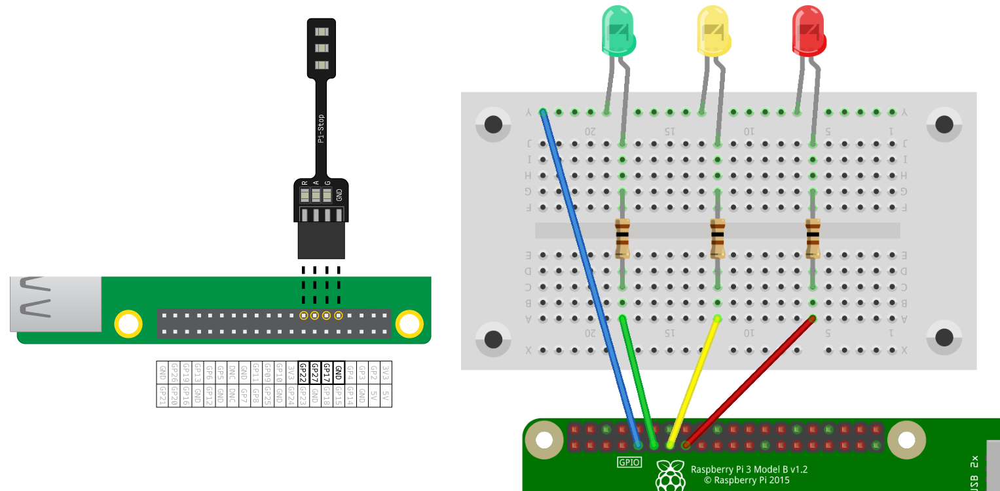

## Verbinde die LEDs (Leuchtdioden)

--- task ---

Verbinde deine LEDs (Leuchtdioden) wie folgt:

| LED  | GPIO-Port / RasPi-Stift |
| ---- |:-----------------------:|
| Rot  |         GPIO 22         |
| Gelb |         GPIO 27         |
| Grün |         GPIO 17         |

--- /task ---