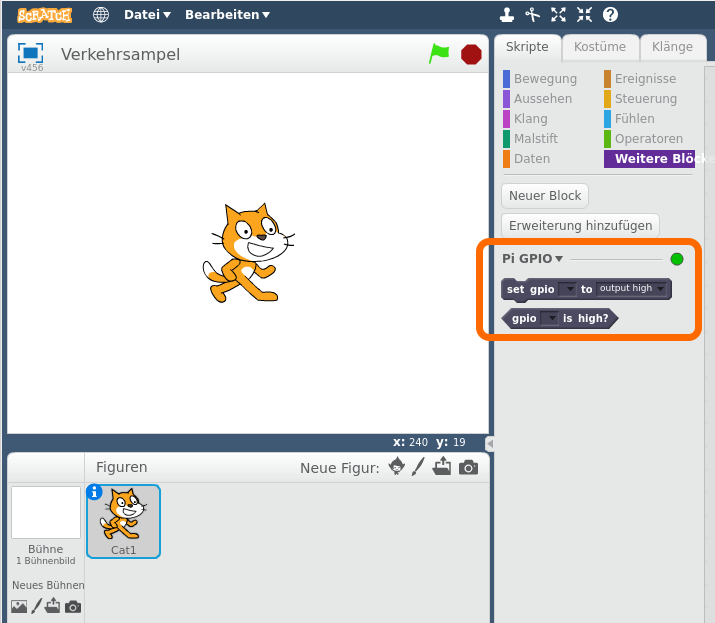

## Steuere die LEDs (Leuchtdioden)

\--- task \---

Öffne **Scratch 3** aus dem Menü Programmieren (**Scratch 3**, nicht **Scratch 2 oder Scratch 1**). Sollte Scratch 3 nicht vorhanden sein, einfach über die Funktion "Add / Remove Software" hinzufügen: Scratch 3 offline.

\--- /task \---

\--- task \---

Füge die **Raspberry Pi GPIO** Erweiterung hinzu.

[[[rpi-scratch-add-pi-gpio]]]

Es sollte nun eine neue Gruppe `Raspberry Pi GPIO`{:class="blockmoreblocks"} hinzugefügt worden sein und dort sind vier neue Befehlsblöcke zu sehen:



\--- /task \---

\--- task \---

Klick auf die Gruppe `Ereignisse`{:class="blockevents"} und ziehe den Block `Wenn die grüne Flagge angeklickt wird`{:class="blockevents"} in das Skripte Fenster.

```blocks
wenn die grüne Flagge angeklickt wird
```

\--- /task \---

\--- task \---

Klick auf die Gruppe `Raspberry Pi GPIO`{:class="blockmoreblocks"} und ziehe den `set gpio to output high`{:class="blockmoreblocks"} Block in das Skripte Feld und hänge es unter den vorherigen Block ein.

Set the gpio to number `22`.

```blocks
when green flag clicked
set gpio [22 v] to [output high v] :: extension
```

\--- /task \---

\--- task \---

Klicke jetzt auf die grüne Flagge, um deinen Code zu starten. Du solltest sehen, dass die rote LED aufleuchtet.

\--- /task \---

\--- task \---

Now add a `wait 1 secs`{:class="blockcontrol"} block before and after turning the LED off with `set gpio 22 to output low`{:class="blockmoreblocks"}, and wrap it in a **forever** block to blink continuously:

```blocks
when green flag clicked
forever
set gpio [22 v] to [output high v] :: extension
wait [1] secs
set gpio [22 v] to [output low v] :: extension
wait [1] secs
end
```

\--- /task \---

\--- task \---

Klicke erneut auf die grüne Flagge und du solltest die LED blinken sehen.

\--- /task \---

\--- task \---

Now add some more `set gpio`{:class="blockmoreblocks"} blocks to introduce the other two lights on gpio 27 & 17, and make them all flash on and off:

```blocks
when green flag clicked
forever
set gpio [22 v] to [output high v] :: extension
set gpio [27 v] to [output high v] :: extension
set gpio [17 v] to [output high v] :: extension
wait [1] secs
set gpio [22 v] to [output low v] :: extension
set gpio [27 v] to [output low v] :: extension
set gpio [17 v] to [output low v] :: extension
wait [1] secs
end
```

Klicke erneut auf die grüne Flagge und du solltest sehen, dass alle drei Lichter zusammen blinken.

\--- /task \---

\--- task \---

Can you change the number in `wait 1 secs`{:class="blockcontrol"} to speed up or slow down the sequence?

\--- /task \---