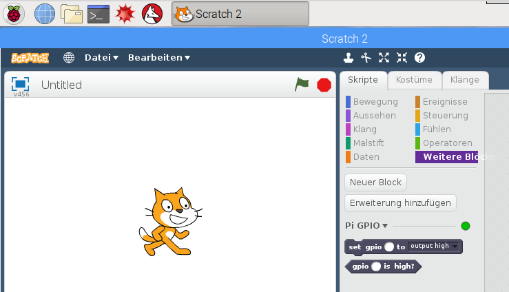
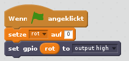
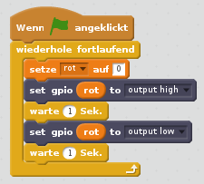
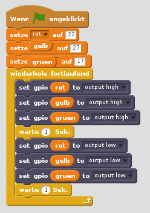

## Die LEDs steuern

1. Öffne **Scratch 2** aus dem Programmiermenü (**Scratch 2**, nicht **Scratch**).

2. Öffne **Weitere Blöcke**, klicke auf **Erweiterung hinzufügen**und wähle **Pi GPIO**. Du solltest dann zwei neue Blöcke sehen:
    
    

3. Öffne **Ereignisse** im Register Skripte und ziehe einen **wenn Fahne angeklickt** Block in das rechte Fenster.

4. Öffne nun **Daten** und klicke auf **Neue Variable**. Gib den Variablennamen **rot**ein, ziehe **setze rot auf 0** hinein, docke es unter den vorherigen Block und setze den Wert auf **22**.

5. Öffne **Weitere Blöcke**. Ziehe **set gpio to output high** hinein und docke es unter den vorherigen Block.

6. Zurück zu den **Daten**. Ziehe einen Variablen-Block **rot** auf den weißen Kreis im **set gpio** Block. Dein Code sollte jetzt so aussehen:
    
    

7. Klicke jetzt auf die grüne Flagge, um deinen Code zu starten. Du solltest sehen, dass die rote LED aufleuchtet.

8. Füge jetzt aus Steuerung ein **warte 1 Sek.** vor und nach dem Ausschalten der LED mit **set gpio rot to output low**ein. Umgib diese Befehle mit einem **wiederhole fortlaufend** Block, um kontinuierlich zu blinken:
    
    

9. Klicke erneut auf die grüne Flagge und du solltest die LED blinken sehen.

10. Füge nun weitere **set gpio**-Blocks ein, um auch die beiden anderen LEDs blinken zu lassen:
    
    

11. Klicke erneut auf die grüne Flagge und du solltest sehen, dass alle drei Lichter zusammen blinken.

12. Kannst du die Zahl in **warte 1 Sek.** ändern, um die Sequenz zu beschleunigen oder zu verlangsamen?