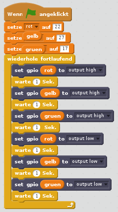

## Ampel Sequenz

1. Versuche die Lichter der Reihe nach ein- und auszuschalten:

    

1. Jetzt weißt du, wie man die Lichter individuell steuert und die Pausen zwischen den Befehlen einstellt. Kannst du eine Ampelsequenz erstellen? Die Reihenfolge lautet:
    
    - Grün ein
    - Gelb ein
    - Rot ein
    - Rot und Gelb ein
    - Grün ein

Es ist wichtig, über das Timing nachzudenken. Wie lange sollten die Lichter in jeder Phase eingeschaltet bleiben?

Wenn du die Ampelsequenz abgeschlossen hast, kannst du versuchen, eine Schaltfläche und einen Summer hinzuzufügen, um eine interaktive Ampel für einen Fußgängerübergang zu erstellen.
