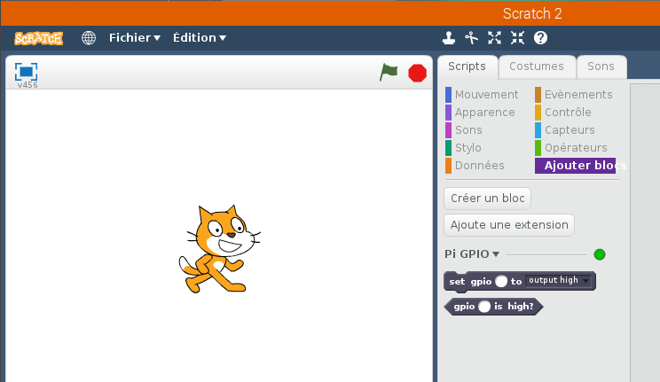
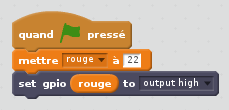
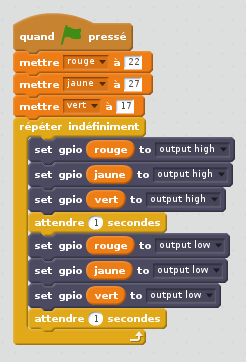

## Contrôlez les DELs

1. Lancez **Scratch 2** à partir du menu de Programmation (**Scratch 2**, pas **Scratch**).

2. Ouvrez le panneau **Ajouter blocs**, cliquez sur **Ajoute une extension**, puis sélectionnez **Pi GPIO**. Vous devriez voir deux nouveaux blocs apparaître:
    
    

3. Ouvrez le panneau **Évènements** et faites glisser un bloc **quand ⚑ pressé**.

4. Ouvrez le panneau **Données** et cliquez sur **Créer une variable**. Entrez le nom de variable **rouge**, faites glisser un **mettre rouge à 0**, ancrez-le sous le bloc précédent et mettez la valeur à **22**.

5. Ouvrez le panneau **Ajouter blocs**, faites glisser un bloc **set gpio to output high** et ancrez le sous le bloc précédent.

6. Retournez au panneau **Données** et faites glisser un bloc variable **rouge** et placez-le dans le bloc **set gpio**. Votre code devrait maintenant avoir l'air de ceci:
    
    

7. Maintenant cliquez sur le drapeau vert pour exécuter votre code. Vous devriez voir la DEL rouge s'allumer.

8. Maintenant ajoutez un bloc **attendre 1 secondes** avant et après un bloc **set gpio rouge to output low** pour éteindre la DEL. Insérez le tout dans un bloc **répéter indéfiniement** pour qu'elle clignote continuellement:
    
    

9. Cliquez à nouveau sur le drapeau vert et vous devriez voir la DEL clignoter.

10. Maintenant, ajoutez plus de blocs **set gpio** pour introduire les deux autres feux et les faire tous clignoter:
    
    

11. Cliquez à nouveau sur le drapeau vert et vous devriez voir les trois feux clignoter ensemble.

12. Pouvez-vous changer le nombre dans **attendre 1 secondes** pour accélérer ou ralentir la séquence?