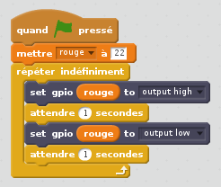

## Contrôler les LED

1. Ouvrez **Scratch 2** à partir du menu de programmation (**Scratch 2**, pas **Scratch**).

2. Ouvrez le panneau **Ajouter blocs**, cliquez sur **Ajouter une extension**, puis sélectionnez **Pi GPIO**. Vous devriez alors voir apparaître deux nouveaux blocs:
    
    

3. Ouvrez le panneau **Événements** et faites glisser dans un bloc **quand ⚑ cliqué**.

4. Ouvrez le panneau de **Données** et cliquez sur **Créer une Variable**. Entrez le nom de la variable **rouge**, faites glisser un **mettre rouge à 0** dedans, ancrez-le sous le bloc précédent et mettez la valeur sur **22**.

5. Ouvrez le panneau **Ajouter blocs**, faites glisser un bloc **set gpio to output high** et l'ancrez sous le bloc précédent.

6. Retourne au panneau **Données** et faites glisser un bloc variable **rouge** et placez-le dans le bloc **set gpio**. Votre code devrait maintenant ressembler à ceci:
    
    

7. Maintenant, cliquez sur le drapeau vert pour exécuter votre code. Vous devriez voir que la LED rouge s'allume.

8. Maintenant, ajoutez un bloc **attendre 1 secondes** avant et après avoir éteint la LED avec **set gpio red to output low**, et l'enroulez dans un bloc **répéter indéfiniment** pour clignoter continuellement:
    
    

9. Cliquez à nouveau sur le drapeau vert et vous devriez voir que la LED clignote.

10. Maintenant, ajoutez-en plus des blocs **set gpio** pour introduire les deux autres feux, et les faire tous s'allumer et s'éteindre:
    
    

11. Cliquez à nouveau sur le drapeau vert et vous devriez voir que les trois feux clignotent ensemble.

12. Pouvez-vous changer le nombre en **attendre 1 secondes** pour accélérer ou ralentir la séquence?