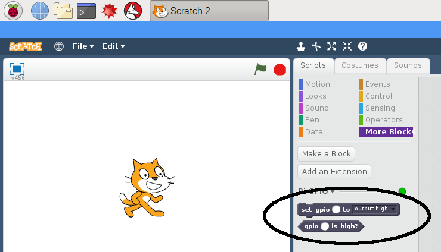

## एल. ई. डी. को नियंत्रित करें.

\--- task \---

प्रोग्रामिंग मेनू से **Scratch 2** ओपन करे (**Scratch 2**, **Scratch**नहीं)

\--- /task \---

\--- task \---

** Pi GPIO ** एक्सटेंशन जोड़ें।</0>

[[[rpi-scratch-add-pi-gpio]]]

फिर आपको दो नए ब्लॉक दिखाई देने चाहिए ` अधिक ब्लॉक ` {: class = "blockmoreblocks"}:



\--- /task \---

\--- task \---

` ईवेंट ` {: class = "blockevents"} पैनल खोलें और ` फ्लैग क्लिक किए जाने पर ` {: class = "blockevents"} ब्लॉक में खींचें।

```blocks
when green flag clicked
```

\--- /task \---

\--- task \---

` और अधिक ब्लॉक खोलें </ 0> {: class = "blockmoreblocks"} पैनल, खींचें में <<>> gpio आउटपुट के लिए उच्च </ 0> {: class = "blockmoreblocks"} ब्लॉक करें और इसे नीचे डॉक करें पिछला ब्लॉक।</p>

<p>Gpio को संख्या <code> 22 ` पर सेट करें।

```blocks
जब हरी झंडी दिखे
gpio [22 v] को [आउटपुट हाई v] :: एक्सटेंशन में सेट करें
```

\--- /task \---

\--- task \---

अब अपना कोड चलाने के लिए हरी झंडी पर क्लिक करें। आपको लाल एल. ई. डी. लाइट जलती दिखेगी।

\--- /task \---

\--- task \---

अब ` प्रतीक्षा 1 सेकंड </ 0> {: class = "blockcontrol"} को जोड़ने से पहले और बाद में बंद करें <code> set gpio 22 to output low ` {: class = "blockmoreblock"}, और इसे लगातार 1 पलक के लिए ** हमेशा के लिए ** ब्लॉक में लपेटें:

```blocks
when green flag clicked
forever
set gpio [22 v] to [output high v] :: extension
wait [1] secs
set gpio [22 v] to [output low v] :: extension
wait [1] secs
end
```

\--- /task \---

\--- task \---

हरे झंडे को फिर से क्लिक करने पर आपको एल. ई. डी. झिलमिलाता दिखेगा।

\--- /task \---

\--- task \---

अब कुछ और `set gpio` ब्लॉक अन्य दो रोशनी शुरू करने के लिए जोड़ें, और उन सब को चालू और बंद करें:

```blocks
when green flag clicked
forever
set gpio [22 v] to [output high v] :: extension
set gpio [27 v] to [output high v] :: extension
set gpio [17 v] to [output high v] :: extension
wait [1] secs
set gpio [22 v] to [output low v] :: extension
set gpio [27 v] to [output low v] :: extension
set gpio [17 v] to [output low v] :: extension
wait [1] secs
end
```

हरे झंडे को फिर से क्लिक करने पर आपको तीनों रोशनी एक साथ जलती दिखेगी।

\--- /task \---

\--- task \---

क्या आप क्रम की गति तेज या धीमा करने के लिए `wait 1 secs` में नंबर बदल सकते हैं?

\--- /task \---