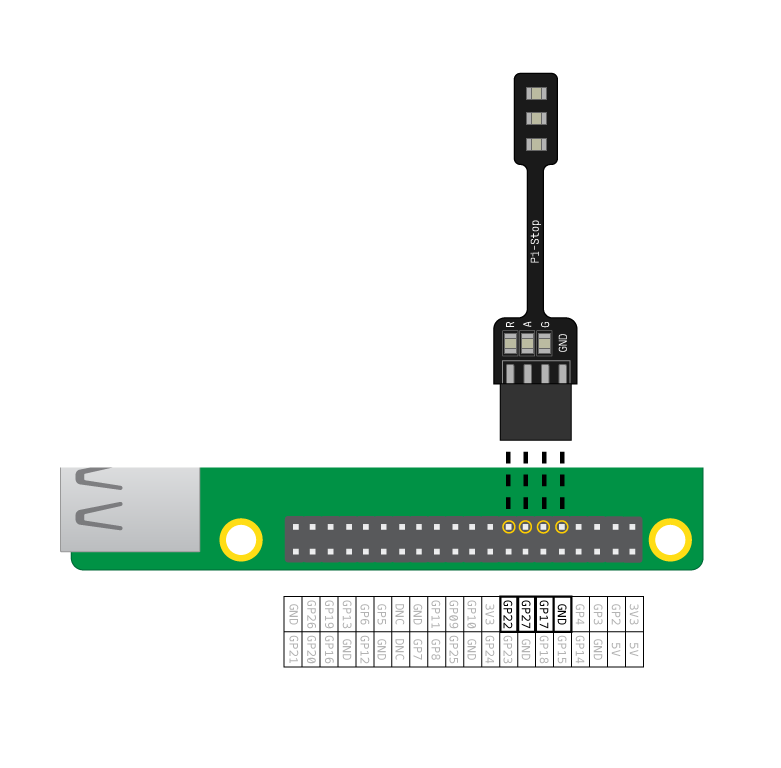

## Csatlakoztasd a LED-eket

\--- task \---

Csatlakoztasd a LED-eket a következő tüskékhez:

| LED   | GPIO tüske |
| ----- |:----------:|
| Piros |     22     |
| Sárga |     27     |
| Zöld  |     17     |

\--- /task \---