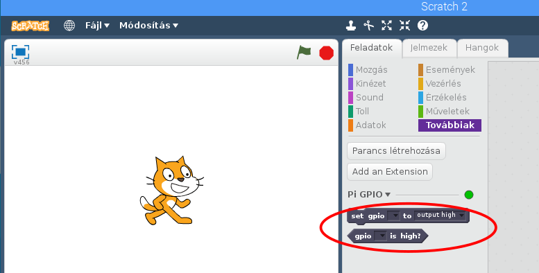

## Vezéreld a LED-eket

\--- task \---

Nyisd meg a **Scratch 2**-t a Programozás menüből (ne a **Scratch**-t).

\--- /task \---

\--- task \---

Add hozzá a **Pi GPIO** extension-t.

[[[rpi-scratch-add-pi-gpio]]]

Két új blokkot kell látnod a `Továbbiak`{:class="blockmoreblocks"} alatt:



\--- /task \---

\--- task \---

Nyisd meg az `Események`{:class="blockevents"} panelt és húzd be `⚑ -ra kattintáskor`{:class="blockevents"} blokkot.

```blocks
⚑ -ra kattintáskor
```

\--- /task \---

\--- task \---

Nyisd meg a `Továbbiak`{:class="blockmoreblocks"} panelt, húzd be a `set gpio to output high`{:class="blockmoreblocks"} blokkot and és illesztd az előző blokkhoz.

Állítsd a gpio számát `22`.

```blocks
⚑ -ra kattintáskor
set gpio [22 v] to [output high v] :: extension
```

\--- /task \---

\--- task \---

És most nyomd meg a zöld zászlót a kódod futtatásához. You should see the red LED light up.

\--- /task \---

\--- task \---

Now add a `wait 1 secs`{:class="blockcontrol"} block before and after turning the LED off with `set gpio 22 to output low`{:class="blockmoreblocks"}, and wrap it in a **forever** block to blink continuously:

```blocks
when green flag clicked
forever
set gpio [22 v] to [output high v] :: extension
wait [1] secs
set gpio [22 v] to [output low v] :: extension
wait [1] secs
end
```

\--- /task \---

\--- task \---

Click the green flag again and you should see the LED blink.

\--- /task \---

\--- task \---

Now add some more `set gpio`{:class="blockmoreblocks"} blocks to introduce the other two lights on gpio 27 & 17, and make them all flash on and off:

```blocks
when green flag clicked
forever
set gpio [22 v] to [output high v] :: extension
set gpio [27 v] to [output high v] :: extension
set gpio [17 v] to [output high v] :: extension
wait [1] secs
set gpio [22 v] to [output low v] :: extension
set gpio [27 v] to [output low v] :: extension
set gpio [17 v] to [output low v] :: extension
wait [1] secs
end
```

Click the green flag again and you should see the three lights flash together.

\--- /task \---

\--- task \---

Can you change the number in `wait 1 secs`{:class="blockcontrol"} to speed up or slow down the sequence?

\--- /task \---