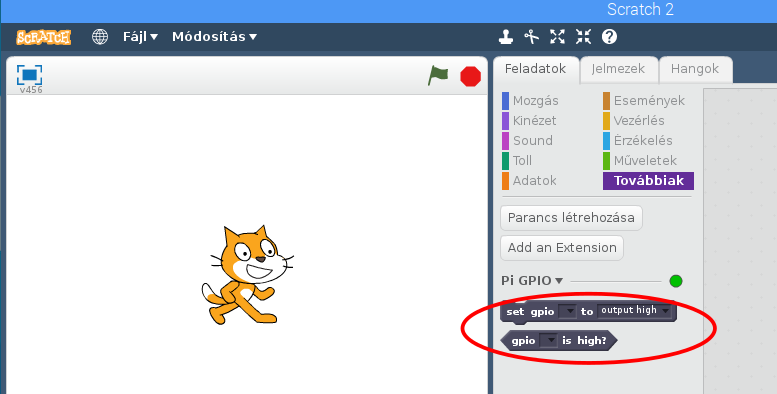

## Irányítsa a LED-eket

1. Nyílt **Scratch 2** a Programozás menüből (123_8_2_321 | Scratch 2</strong>, nem **Scratch**).

2. Nyissa meg a **További blokkokat** panel, kattintson a **Bővítmény hozzáadása**és válassza a 123_8_4_321 | Pi GPIO</strong>pontot. Ezután két új blokkot kell megjeleníteni:
    
    

3. Nyissa meg a **Események** panel és húzza a **-ban, ha a zászlót a 123_9_3_321 | gombra kattintotta Blokk.
</li> 
    
    - Nyissa meg a **Adatok** panel és kattintson a 123_8_2_321 | Változó létrehozása</strong>. Adja meg a változó nevét **piros**, húzza a **piros beállítást 0** in, csatolja az előző blokk alá, és állítsa az értéket **22**-ra.
    
    - Nyissa meg a **További blokkokat** panel, húzza át a **állítsa be a gpio értéket** blokkolja és rögzítse az előző blokk alatt.
    
    - Visszatérés **Adatok** panel és húzza a **piros** változtatható blokkot, és helyezze el a **set gpio** Blokk. A kódnak így kell kinéznie:
        
        
    
    - Most kattintson a zöld zászlóra a kód futtatásához. A piros LED világít.
    
    - Add add a 123_8_0_321 | wait 1 mp</strong> 123_8_2_321 | állítsa be a gpio pirosat a kimenetre alacsony</strong>, és csomagolja be a 123 123_8_4_321 | örökre | ​​123_9_5_321 | blokk folyamatosan villog:
        
        
    
    - Kattintson újra a zöld zászlóra, és látnia kell a LED villogását.
    
    - Now add some more **set gpio** blocks to introduce the other two lights, and make them all flash on and off:
        
        
    
    - Kattints újra a zöld zászlóra, és látnod kell, hogy a három lámpa villog együtt.
    
    - Módosíthatja a számot **várjon 1 másodpercet** hogy felgyorsítsa vagy lelassítsa a szekvenciát?</ol>