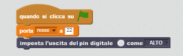
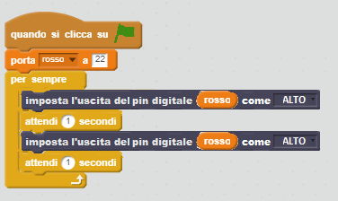

## Controllare i LED

1. Apri **Scratch** dal menu principale (**Scratch**, non **Scratch 2**).

2. Apri il pannello **Altri blocchi**, fai clic su **Aggiungi estensione**, e seleziona **Pi GPIO**. Dovresti quindi vedere apparire due nuovi blocchi:
    
    

3. Apri il pannello **Eventi** e trascina nel pannello un blocco**Quando si clicca su ⚑**.

4. Apri il pannello **Dati** e fai click su **Crea una variabile**. Immetti il nome della variabile **rosso**, trascina un blocco **porta rosso a 0** nel pannello, posizionalo sotto il blocco precedente e imposta il valore su **22**.

5. Apri il pannello **Altri blocchi**, trascina un blocco **imposta l'uscita del pin digitale come ALTO** e posizionalo sotto il blocco precedente.

6. Ritorna al pannello **Dati**, trascina il blocco della variabile **rosso** nel pannello e posizionalo all'interno del blocco **imposta l'uscita del pin digitale**. Il tuo codice dovrebbe apparire così:
    
    

7. Adesso fai clic sulla bandierina verde per eseguire il tuo codice. Il LED rosso dovrebbe accendersi.

8. Adesso aggiungi un blocco **attendi 1 secondo** prima e dopo il blocco **imposta l'uscita del pin digitale come BASSO**, e avvolgi tutto in un blocco **per sempre**, per far sì che il LED lampeggi continuamente:
    
    

9. Fai di nuovo click sulla bandierina verde. Il LED dovrebbe lampeggiare.

10. Adesso aggiungi altri blocchi **imposta l'uscita del pin digitale**, per introdurre le altre due luci e farle accendere e spegnere tutte:
    
    

11. Fai di nuovo click sulla bandierina verde. Dovresti vedere le tre luci lampeggiare insieme.

12. Prova a modificare il numero all'interno del blocco **attendi 1 secondo** per far accelerare o rallentare la sequenza!