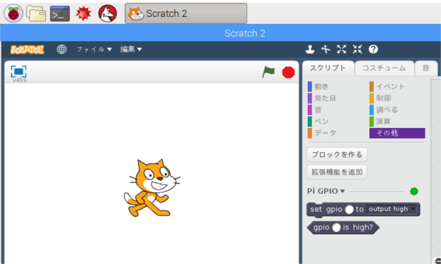
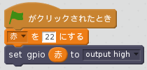
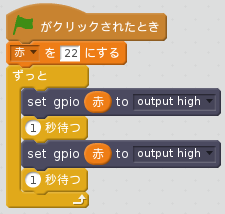
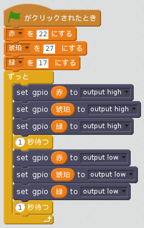

## LEDの制御

1. プログラミングメニューから**Scratch 2**を開きます（**Scratch**ではなく、**Scratch 2**です）

2. **その他**のパネルを開き、**拡張機能を追加**をクリックして、**Pi GPIO**を選択します。 2つの新しいブロックが表示されます。
    
    

3. **イベント**のパネルを開きます。**旗がクリックされたとき**のブロックをドラッグします。

4. **データ**のパネルを開き、 **変数を作る**のブロックをクリックします。 新しい変数のダイアログが表示されるので、変数名に**赤**と入力してOKをクリックします。 次に**赤を0に設定する**のブロックを、前のブロックの下にドッキングし、値を**22**に設定します。

5. **その他**のパネルを開きます。**set gpio to output high**のブロックを、前のブロックの下にドッキングします。

6. **データ**のパネルを開きます。**赤**のブロックを**set gpio to output high**の中にドラッグします。 コードは以下のようになります：
    
    

7. 次に緑色の旗をクリックしてコードを実行します。 赤色のLEDが点灯するはずです。

8. 制御のパネルを開き、**1秒待つ**のブロックを **set gpio 赤 to output high 、set gpio 赤 to output low**のブロック前後に追加します。連続的に点滅させるために、**ずっと**ブロックの中に入れます。：
    
    

9. 緑の旗をもう一度クリックすると、LEDが点滅するはずです。

10. さらにブロックを追加し**set gpio**ブロックを他の2つのライトにも適用します。それらのライトすべてをオンまたはオフできます。
    
    

11. 緑色の旗をもう一度クリックすると、3つのライトが一緒に点滅するのがわかります。

12. **1秒待つ**のブロックの中の数を変更できますか？シーケンスをスピードアップまたはスローダウンできます。