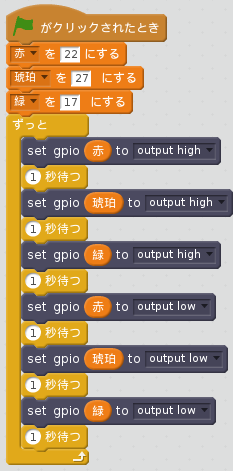

## 信号灯のシーケンス

1. 順番にライトをオンまたはオフにしてみてください：

1. 次はライトを個別に制御する方法や、点灯や消灯の停止時間を把握しましょう。信号灯のシーケンスを作成することができますか？ シーケンスは次のようになります。
    
    - 緑オン
    - 琥珀オン
    - 赤オン
    - 赤と琥珀オン
    - 緑オン

タイミングについて考えることが重要です。 各ステージでどれくらいの間ライトが点灯し続けるのでしょうか？

信号灯のシーケンス作成を完了したら、ボタンとブザーを追加して対話形式の横断歩道を作りたくなるかもしれませんね。