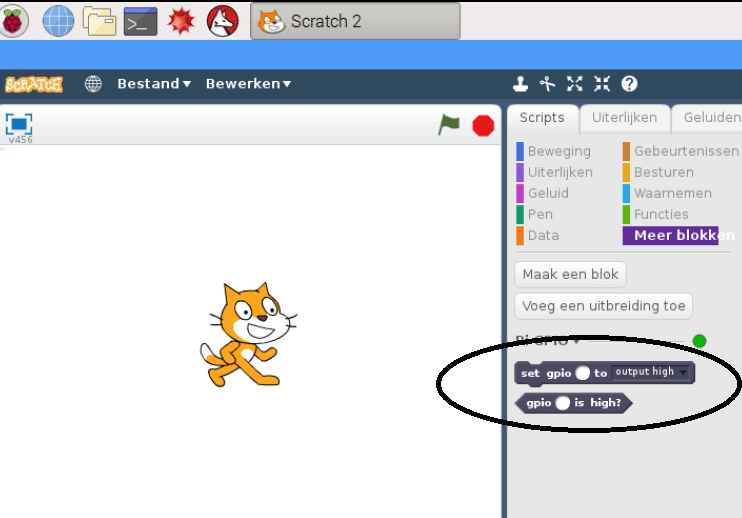

## Bedien de LED's

\--- task \---

Open **Scratch 2** uit het Start menu (**Scratch 2**, niet **Scratch**).

\---/task\---

\--- task \---

Add the **Pi GPIO** extension.

[[[rpi-scratch-add-pi-gpio]]]

You should then see two new blocks appear in `More Blocks`{:class="blockmoreblocks"}:



\--- /task \---

\--- task \---

Open the `Events`{:class="blockevents"} panel and drag in a `when flag clicked`{:class="blockevents"} block.

```blocks
wanneer op de groene vlag wordt geklikt
```

-- /task \---

\--- task \----

Open the `More Blocks`{:class="blockmoreblocks"} panel, drag in a `set gpio to output high`{:class="blockmoreblocks"} block and dock it under the previous block.

Set the gpio to number `22`.

```blocks
when green flag clicked
set gpio [22 v] to [output high v] :: extension
```

\--- /task \---

\--- task \---

Klik nu op de groene vlag om je code uit te voeren. Je zou de rode LED moeten zien oplichten.

\--- /task \---

\--- task \---

Now add a `wait 1 secs`{:class="blockcontrol"} block before and after turning the LED off with `set gpio 22 to output low`{:class="blockmoreblocks"}, and wrap it in a **forever** block to blink continuously:

```blocks
when green flag clicked
forever
set gpio [22 v] to [output high v] :: extension
wait [1] secs
set gpio [22 v] to [output low v] :: extension
wait [1] secs
end
```

\--- /task \---

\--- task \---

Klik nogmaals op de groene vlag en je zou de LED moeten zien knipperen.

\--- /task \---

\--- task \---

Now add some more `set gpio`{:class="blockmoreblocks"} blocks to introduce the other two lights on gpio 27 & 17, and make them all flash on and off:

```blocks
when green flag clicked
forever
set gpio [22 v] to [output high v] :: extension
set gpio [27 v] to [output high v] :: extension
set gpio [17 v] to [output high v] :: extension
wait [1] secs
set gpio [22 v] to [output low v] :: extension
set gpio [27 v] to [output low v] :: extension
set gpio [17 v] to [output low v] :: extension
wait [1] secs
end
```

Klik nogmaals op de groene vlag en je zou alle drie LED's moeten zien knipperen.

\--- /task \---

\--- task \---

Can you change the number in `wait 1 secs`{:class="blockcontrol"} to speed up or slow down the sequence?

\--- /task \---