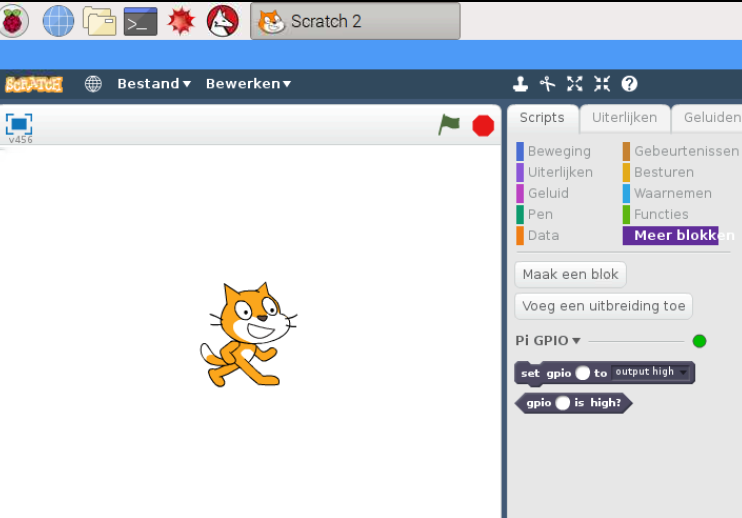
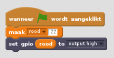
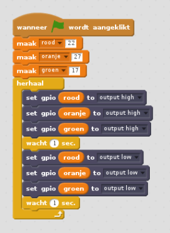

## Stuur de LED's aan

1. Open **Scratch 2** uit het Start menu (**Scratch 2**, niet **Scratch**).

2. Open het **Meer blokken** paneel, klik op **Voeg een uitbreiding toe**, selecteer **Pi GPIO** en klik op OK. Je zou nu twee nieuwe blokken moeten zien:
    
    

3. Open het **Gebeurtenissen** paneel en sleep een **wanneer vlag wordt aangeklikt** blok naar het programma venster.

4. Open het **Data** paneel en klik op **Maak een variabele**. Voer als naam van de variabele **rood** in, sleep een **maak rood 0** naar het programma venster, plaats het onder het vorige blok en stel de waarde in op **22**.

5. Open het **Meer blokken** paneel, versleep een **set gpio to output high** blok naar het programma venster en koppel het aan het vorige blok.

6. Keer terug naar het **Data** paneel en sleep een **rood** blok naar het programma venster en plaats het in het **set gpio** blok. Je code zou er nu als volgt uit moeten zien:
    
    

7. Klik nu op de groene vlag om je code uit te voeren. Je zou de rode LED moeten zien oplichten.

8. Voeg nu een **set gpio rood to output low** toe, voeg ervoor en erna een **wacht 1 sec** blok toe en omsluit het geheel in een **herhaal** blok om de LED continu te laten knipperen:
    
    

9. Klik nogmaals op de groene vlag en je zou de LED moeten zien knipperen.

10. Voeg nu wat meer **set gpio** blokken toe om de andere twee Led's ook te laten knipperen:
    
    

11. Klik nogmaals op de groene vlag en je zou alle drie LED's moeten zien knipperen.

12. Kun je de tijd in **wacht 1 sec** wijzigen om de reeks te versnellen of te vertragen?