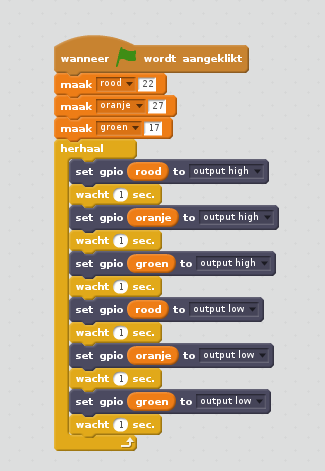

## Verkeerslichten volgorde

1. Probeer de lichten achter elkaar aan en uit te schakelen:

1. Nu weet je hoe je de lichten afzonderlijk kunt besturen en de pauzes tussen opdrachten door kunt aanpassen, kunt je nu de juiste volgorde van de verkeerslichten instellen? De volgorde is als volgt:
    
    - Rood uit en groen aan
    - Groen uit en oranje aan
    - Oranje uit en rood aan
    - Rood uit en groen aan
    - 

Het is belangrijk om na te denken over de tijdsduur van elk licht. Hoe lang moet het licht in elke fase aan blijven?

Nadat je de volgorde van het verkeerslicht hebt voltooid, kunt je proberen een knop en een zoemer toe te voegen om een ​​interactief verkeerslicht te maken voor een zebrapad.